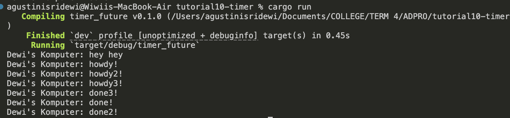
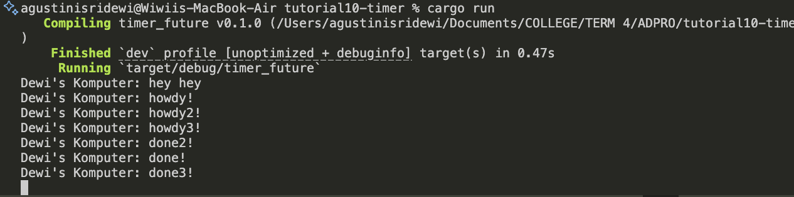
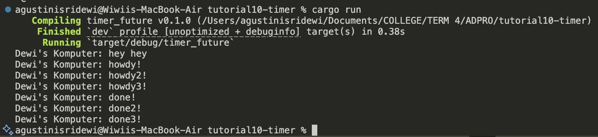

## AdvProg Tutorial 10 Timer
Agus Tini Sridewi / 2306276004 / ADPRO A

### 1.2 Understanding how it works

Saat program dijalankan, pesan pertama yang muncul adalah "Dewi's Komputer: hey hey". Ini terjadi karena perintah tersebut langsung ditulis di fungsi main() dan dieksekusi segera, sebelum sistem asynchronous mulai bekerja.

Setelah itu, program membuat sebuah task asynchronous. Meskipun sudah dibuat, task ini belum langsung dijalankan karena eksekutor (executor.run()) belum dipanggil. Setelah eksekutor aktif, task mulai dijalankan dan menampilkan pesan "Dewi's Komputer: howdy!" ke layar.

Task kemudian memasuki fase penundaan selama 2 detik menggunakan TimerFuture::new(...). Pada fase ini, task tidak aktif dan menunggu sinyal dari mekanisme penjadwalan internal yang berjalan di latar belakang.

Begitu dua detik berlalu, sistem memberi sinyal bahwa task siap dilanjutkan. Task tersebut dimasukkan kembali ke antrean, dan ketika mendapat giliran lagi, eksekusinya dilanjutkan hingga selesai dengan mencetak pesan terakhir: "Dewi's Komputer: done!".

### 1.3 Multiple Spawn and Removing Drop

Pesan pertama yang muncul adalah "hey hey", karena dicetak langsung dari fungsi main() sebelum executor dijalankan. Kemudian, ketiga task async yang dicetak melalui spawner.spawn() berjalan hampir bersamaan dan langsung menampilkan pesan "howdy!", "howdy2!", dan "howdy3!". Setelah itu, setiap task mengalami jeda 2 detik karena TimerFuture::new(...), lalu menyelesaikan eksekusi masing-masing dengan mencetak pesan "done...". Urutan munculnya pesan "done" bisa bervariasi karena ketiganya berjalan secara konkuren.

Hasilnya mirip: "hey hey" muncul lebih dulu, diikuti oleh ketiga "howdy". Setelah jeda 2 detik, task selesai satu per satu dan mencetak "done". Tapi program tidak pernah selesai sepenuhnya karena executor tidak menerima sinyal bahwa tidak akan ada lagi task yang ditambahkan. Tanpa sinyal itu, executor terus menunggu kemungkinan adanya task baru, membuat program masuk ke kondisi "menunggu selamanya" seolah-olah terjebak dalam status standby tanpa batas waktu.

Pemanggilan drop(spawner) kembali memungkinkan program menyelesaikan seluruh task asynchronous dan keluar. Meskipun urutan pesan "done" berbeda dari image1, tiap eksekusi (karena sifat asynchronous), semua task berhasil dijalankan hingga tuntas. Executor tahu bahwa tidak ada lagi task baru yang akan ditambahkan, sehingga ia hanya menunggu semua task yang sudah dijalankan selesai, lalu menghentikan eksekusi. 
