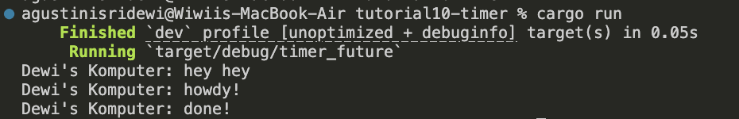

## AdvProg Tutorial 8
Agus Tini Sridewi / 2306276004 / ADPRO A

### 1.2 Understanding how it works

Saat program dijalankan, pesan pertama yang muncul adalah "Dewi's Komputer: hey hey". Ini terjadi karena perintah tersebut langsung ditulis di fungsi main() dan dieksekusi segera, sebelum sistem asynchronous mulai bekerja.

Setelah itu, program membuat sebuah task asynchronous. Meskipun sudah dibuat, task ini belum langsung dijalankan karena eksekutor (executor.run()) belum dipanggil. Setelah eksekutor aktif, task mulai dijalankan dan menampilkan pesan "Dewi's Komputer: howdy!" ke layar.

Task kemudian memasuki fase penundaan selama 2 detik menggunakan TimerFuture::new(...). Pada fase ini, task tidak aktif dan menunggu sinyal dari mekanisme penjadwalan internal yang berjalan di latar belakang.

Begitu dua detik berlalu, sistem memberi sinyal bahwa task siap dilanjutkan. Task tersebut dimasukkan kembali ke antrean, dan ketika mendapat giliran lagi, eksekusinya dilanjutkan hingga selesai dengan mencetak pesan terakhir: "Dewi's Komputer: done!".